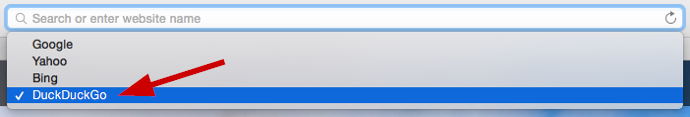
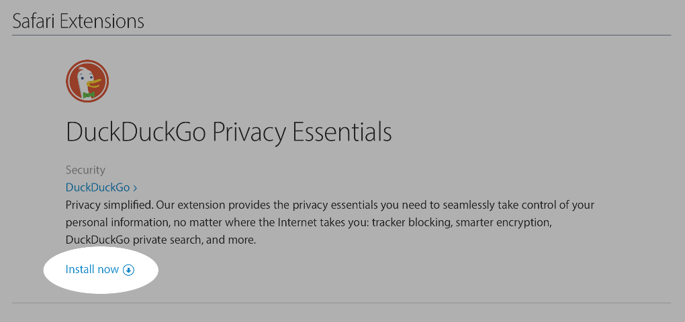

<a class="button" href="https://duck.co/help/mobile/safari-ios" id="safari-button">
            <i class="icon-mobile-phone"></i>
            Did you mean iOS Safari instead?
        </a>
        

            
<h2>Changing your search engine to DuckDuckGo (OS X Yosemite and beyond)</h2>
            

                1. Open a new tab.
                  
                2. Click the magnifying glass in the search bar.
                  
                3. Select the option for DuckDuckGo.
                    
                Alternatively, you can:
                 
                1. Select <em>Preferences</em>.
                 
                2. Choose the <em>Search</em> tab.
                 
                3. Click <em>DuckDuckGo</em> under the <em>Search engine</em> dropdown.
            

        
        

            
<h2>Installing our extension</h2>
            

                1. <a href="https://safari-extensions.apple.com/details/?id=com.duckduckgo.safari-HKE973VLUW">Visit our extension's gallery page.</a>
                                
                2. Click <em>Install now</em>.
                    

        
        

            
<h2 id="uninstall">Uninstalling our extension</h2>
            

                1. Select <em>Preferences</em> in Safari's menu.
                 
                2. Click <em>Extensions</em>.
                 
                3. Click <em>Uninstall</em> for our extension.
                 

        

