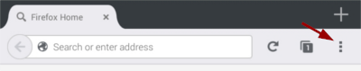
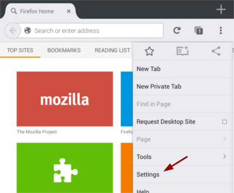
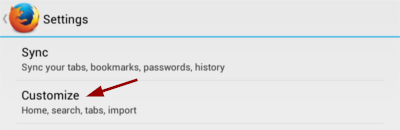
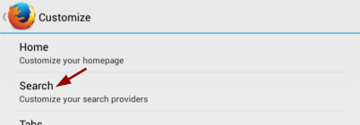
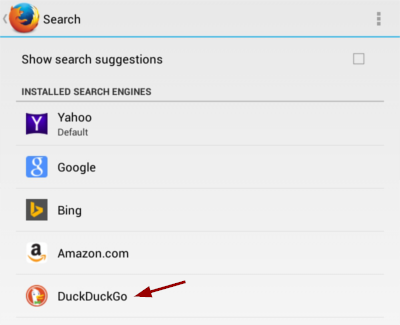
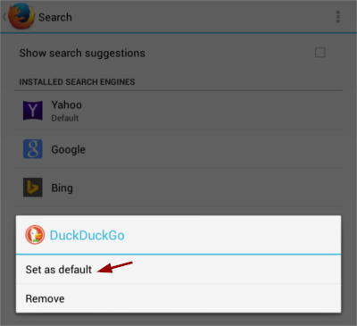

<a class="button" href="https://duck.co/help/desktop/firefox" id="ff-button"><i class="icon-desktop"></i> Did you mean desktop Firefox instead?</a>

    
<h2>Changing your search engine to DuckDuckGo</h2>
    1. Tap the settings icon.
      
    2. Tap <em>Settings</em>.
      
    3. Tap <em>Customize</em>.
      
    4. Tap <em>Search</em>.
      
    5. Tap <em>DuckDuckGo</em>.
      
    6. Tap <em>Set as default</em>.
      